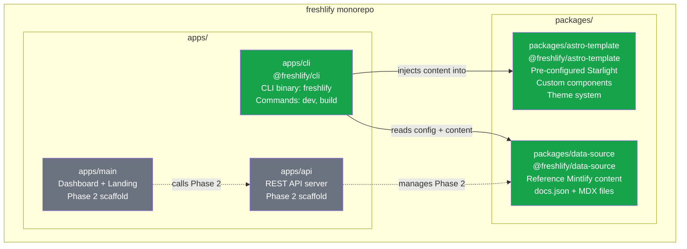
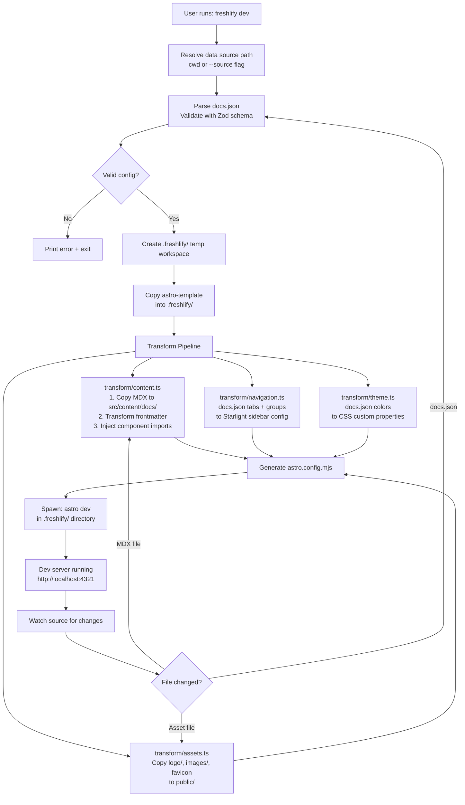
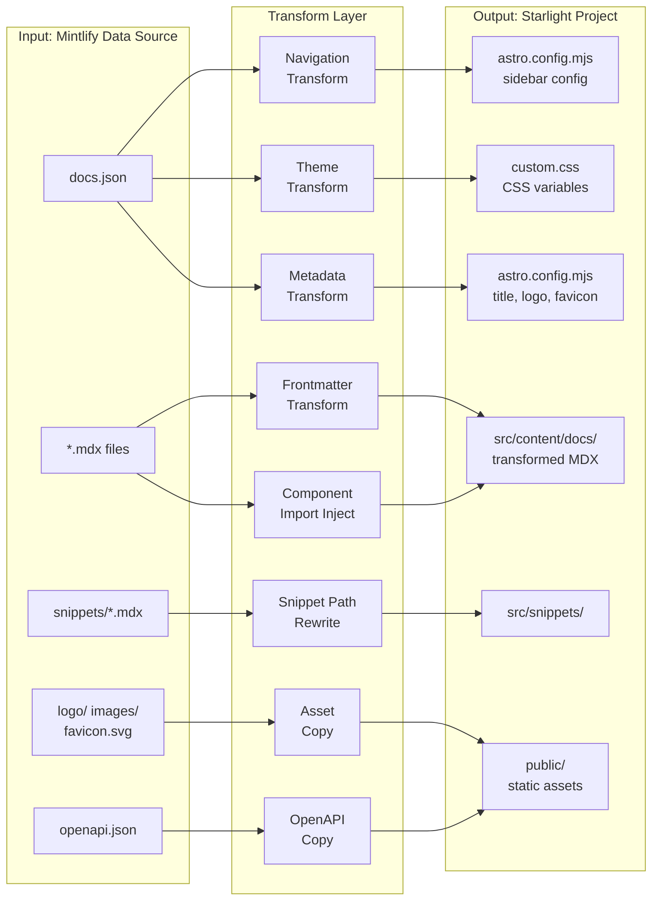
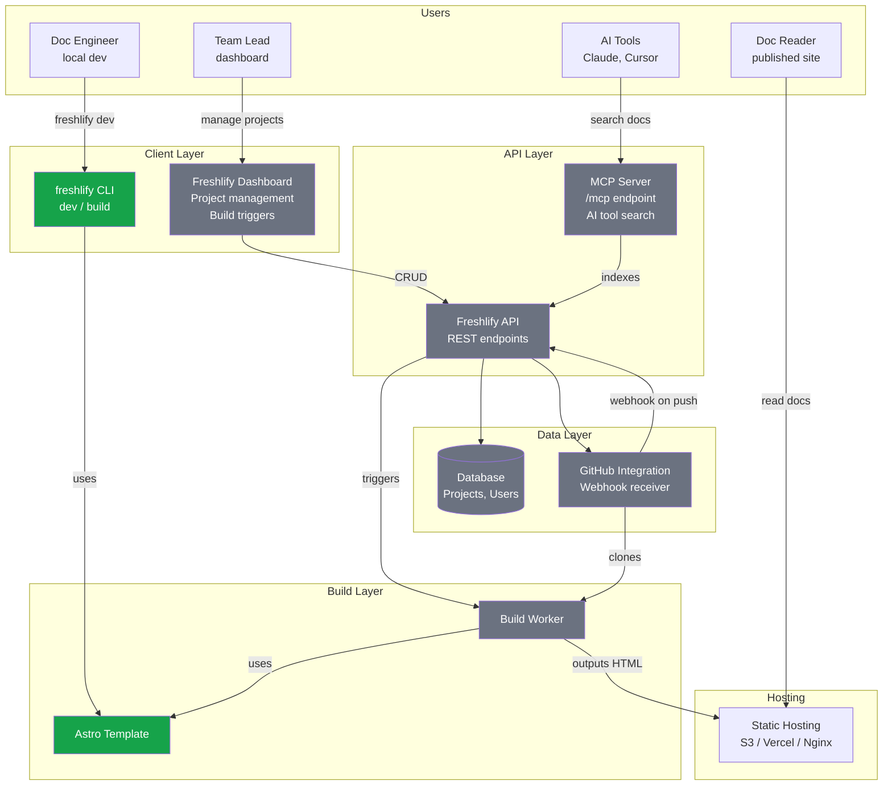
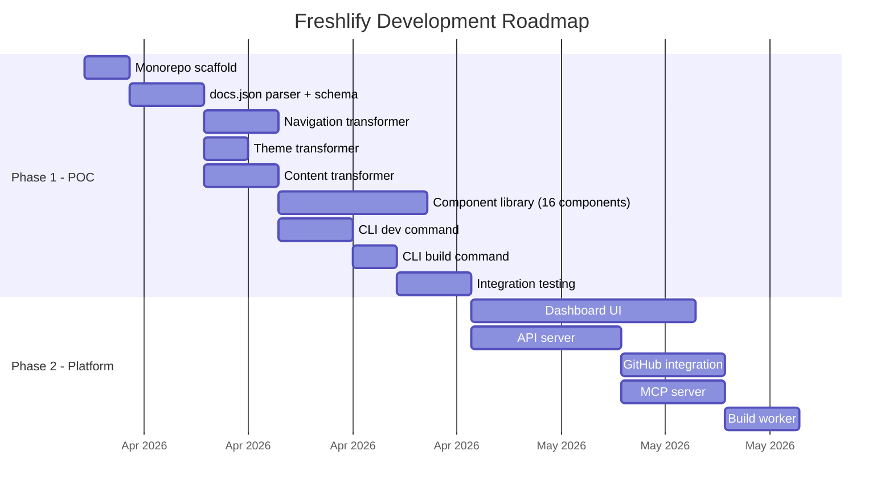

# Freshlify -- Product Requirements Document (PRD)

**Product**: Freshlify -- Self-hosted Mintlify Alternative on Astro Starlight
**Company**: commandoss
**Author**: Engineering Team
**Version**: 1.0 (POC)
**Date**: 2026-03-25
**Status**: Draft

---

## 1. Problem

### Who has the problem

commandoss engineering team -- currently using Mintlify for documentation hosting.

### What it costs them

- **$300/month ($3,600/year)** for Mintlify SaaS subscription
- **Vendor lock-in**: Content is coupled to Mintlify's proprietary rendering pipeline. All custom components (`<Card>`, `<Steps>`, `<Accordion>`, `<CodeGroup>`, `<Note>`, `<Tip>`, `<Warning>`, `<ResponseField>`, `<Expandable>`, `<Frame>`, `<Latex>`, `<Columns>`, `<CardGroup>`, `<AccordionGroup>`) are Mintlify-specific
- **Limited customization**: Mintlify controls the rendering engine -- custom layouts, components, or build-time logic are constrained by their platform
- **No self-hosting option**: Mintlify is SaaS-only -- organizations with data sovereignty or on-prem requirements cannot use it

### How they cope today

Using Mintlify's starter kit (`docs.json` + MDX files) with the `mint dev` CLI for local preview and Mintlify's cloud for production hosting. This works but is expensive and inflexible.

### The opportunity

**Astro Starlight** is a free, open-source documentation framework with built-in search (Pagefind), dark/light mode, i18n, code highlighting (Expressive Code), and component overrides. By building a compatibility layer that reads Mintlify's `docs.json` format and transforms it into Starlight configuration, commandoss can **preserve their existing content investment** while **eliminating SaaS costs entirely**.

---

## 2. Why Now


| Driver                          | Detail                                                                                                                                                                           |
| ------------------------------- | -------------------------------------------------------------------------------------------------------------------------------------------------------------------------------- |
| **Astro Starlight maturity**    | Starlight has reached production stability with robust theming, component overrides, and plugin APIs -- making it a viable foundation                                            |
| **Existing content investment** | commandoss already has documentation in Mintlify format (18 MDX files, OpenAPI spec, custom components). A migration tool preserves that investment                              |
| **Budget pressure**             | $3,600/year is an ongoing line item that can be permanently eliminated with a one-time engineering investment                                                                    |
| **AI tooling ecosystem**        | The rise of MCP servers and AI-assisted documentation workflows means a self-hosted solution can integrate these capabilities without paying for Mintlify's built-in AI features |
| **Team capability**             | The team has the engineering capacity to build and maintain this tooling now                                                                                                     |


---

## 3. Success Criteria


| Metric                                                              | Target                                                           | Measurement Method                               |
| ------------------------------------------------------------------- | ---------------------------------------------------------------- | ------------------------------------------------ |
| `freshlify dev` starts without errors on existing Mintlify starter  | 100% success rate                                                | Manual QA: run CLI against reference data source |
| Navigation structure renders correctly (tabs, groups, nested pages) | All tabs and groups from `docs.json` appear in Starlight sidebar | Visual comparison with Mintlify output           |
| Core Mintlify components render in Starlight                        | 10 of 16 identified components have functional equivalents       | Component checklist verification                 |
| Theme colors from `docs.json` apply to Starlight site               | Primary, light, and dark colors reflected in rendered CSS        | Visual inspection in light and dark modes        |
| MDX content files render without build errors                       | 0 build errors on reference data source (18 MDX files)           | Astro build output                               |
| Local dev server hot-reload works                                   | Content changes reflect in browser within 3 seconds              | Manual testing                                   |
| Time from `freshlify dev` to server ready                           | Under 10 seconds                                                 | Stopwatch measurement                            |
| Monthly hosting cost                                                | $0 (self-hosted static files)                                    | N/A                                              |


---

## 4. User Needs and Scenarios

### Need 1: Local Development Preview

> **As a** documentation engineer at commandoss,
> **I want to** run `freshlify dev` in my docs directory and see a live preview at `localhost:4321`,
> **So that** I can write and preview documentation without paying for Mintlify.

**Scenario**: Engineer opens terminal in the docs repo (containing `docs.json` and MDX files), runs `freshlify dev`. Within 10 seconds, a browser tab opens showing the documentation site with correct navigation, styling, and content. They edit `quickstart.mdx`, save, and see the change reflected in the browser within 3 seconds.

### Need 2: Zero-Migration Content Compatibility

> **As a** documentation engineer,
> **I want to** point Freshlify at my existing Mintlify-format docs repo and have it render all pages correctly,
> **So that** I do not need to rewrite my content.

**Scenario**: Engineer clones the existing Mintlify starter repo. Without changing any files, they run `freshlify dev`. All 18 MDX pages render correctly including Cards, Steps, Accordions, code blocks, and API reference pages. The navigation matches the `docs.json` structure.

### Need 3: Branding Customization

> **As a** documentation engineer,
> **I want to** modify colors, logo, and site name in `docs.json` and see changes reflected immediately,
> **So that** I can brand the documentation for any project.

**Scenario**: Engineer changes `colors.primary` from `#16A34A` to `#3B82F6` in `docs.json`. The dev server hot-reloads and the accent color throughout the site updates to blue.

### Need 4: Static Build for Deployment

> **As a** DevOps engineer,
> **I want to** run `freshlify build` to produce static HTML,
> **So that** I can deploy to any hosting provider (Vercel, Netlify, S3, nginx).

**Scenario**: Engineer runs `freshlify build`. Static HTML output is generated in `dist/`. They upload it to an S3 bucket behind CloudFront and the documentation site is live with zero runtime dependencies.

### Need 5: Multi-Project Management (Phase 2)

> **As a** team lead,
> **I want a** dashboard where I can manage multiple documentation projects and link GitHub repos,
> **So that** documentation deployment is streamlined across the organization.

**Scenario**: Team lead logs into Freshlify dashboard, creates a new project, links a GitHub repo containing docs in Mintlify format. On every push to `main`, the docs are automatically rebuilt and deployed.

---

## 5. Scope

### 5.1 In Scope (POC / Phase 1)


| Item                                                       | Description                                                              |
| ---------------------------------------------------------- | ------------------------------------------------------------------------ |
| **CLI package (`@freshlify/cli`)**                         | `freshlify dev` and `freshlify build` commands                           |
| **Astro Starlight template (`@freshlify/astro-template`)** | Pre-configured Starlight project as rendering engine                     |
| `**docs.json` parser**                                     | Reads Mintlify config, validates with Zod, extracts all settings         |
| **Navigation transformer**                                 | Tabs, groups, nested pages → Starlight sidebar config                    |
| **Content transformer**                                    | MDX frontmatter mapping, component import injection, file copy           |
| **Theme transformer**                                      | `docs.json` colors → Starlight CSS custom properties                     |
| **Component compatibility layer**                          | 16 Mintlify components mapped to Starlight/custom equivalents            |
| **Asset handling**                                         | Logo, favicon, images copy to Starlight public directory                 |
| **Snippet support**                                        | Mintlify snippet imports work via Astro MDX                              |
| **OpenAPI basic support**                                  | API reference pages render without errors (full playground is Phase 2)   |
| **Monorepo scaffold**                                      | Turborepo with all 5 packages (only CLI + template functional)           |
| **Reference data source**                                  | Current Mintlify starter content as `@freshlify/data-source` for testing |


### 5.2 Out of Scope (with rationale)


| Item                            | Rationale                                                           |
| ------------------------------- | ------------------------------------------------------------------- |
| **Dashboard app (`apps/main`)** | Not needed for POC -- CLI-only is sufficient for developer workflow |
| **API server (`apps/api`)**     | Not needed until dashboard exists                                   |
| **GitHub repo integration**     | Requires API server infrastructure                                  |
| **MCP server**                  | Explicitly Phase 2 per product roadmap                              |
| **Interactive API playground**  | Complex feature; static API docs sufficient for POC                 |
| **Versioned documentation**     | Advanced feature, not a current requirement                         |
| **i18n / multi-language**       | Not a current requirement for commandoss                            |
| **Analytics**                   | Dashboard feature, not CLI concern                                  |
| **Custom domain config**        | Deployment concern, outside CLI scope                               |


---

## 6. Risks and Assumptions

### Risks


| Risk                            | Likelihood | Impact | Why It Exists                                                                                           | Mitigation                                                                                                                         |
| ------------------------------- | ---------- | ------ | ------------------------------------------------------------------------------------------------------- | ---------------------------------------------------------------------------------------------------------------------------------- |
| **MDX compatibility gaps**      | High       | High   | Mintlify MDX may use syntax or components that Astro's MDX pipeline rejects                             | Build comprehensive component stubs; use remark/rehype plugins to transform incompatible syntax; maintain compatibility test suite |
| **Navigation model mismatch**   | Medium     | High   | Mintlify's tab-based navigation does not map 1:1 to Starlight's sidebar model                           | Use Starlight multi-sidebar or custom header tabs component override                                                               |
| **OpenAPI rendering gap**       | High       | Medium | Mintlify auto-generates rich API pages from OpenAPI + frontmatter; Starlight has no built-in equivalent | POC: static description with method badge. Phase 2: integrate `starlight-openapi` plugin                                           |
| **Frontmatter field conflicts** | Medium     | Medium | Mintlify frontmatter fields (`openapi`, `icon`) may conflict with Starlight's expected schema           | Build frontmatter transformer that maps/strips Mintlify-specific fields                                                            |
| **Maintenance burden**          | Low        | Low    | Mintlify evolves their `docs.json` schema over time                                                     | Document supported schema version; Freshlify defines its own compatibility contract                                                |


### Assumptions


| Assumption                                                                           | What breaks if wrong                                             |
| ------------------------------------------------------------------------------------ | ---------------------------------------------------------------- |
| The existing Mintlify starter is representative of commandoss content patterns       | Need to handle additional components/features not in the starter |
| Astro Starlight's component override system achieves visual similarity with Mintlify | May need significant custom CSS or a full custom theme           |
| Team is comfortable with TypeScript and Node.js                                      | CLI development timeline extends                                 |
| Static site generation (SSG) is acceptable                                           | Would need SSR setup, different architecture                     |
| Pagefind search is an acceptable Mintlify search replacement                         | May need to integrate Algolia or custom search                   |


---

## 7. Constraints


| Constraint                               | Type      | Detail                                                                                        |
| ---------------------------------------- | --------- | --------------------------------------------------------------------------------------------- |
| Must use Astro Starlight                 | Technical | Architectural decision already made -- Starlight is the rendering engine                      |
| Backward compatible with Mintlify format | Technical | Must consume existing `docs.json` and MDX files without requiring manual content changes      |
| Zero runtime cost                        | Business  | Output must be static HTML deployable anywhere. No server runtime for the docs site itself    |
| Monorepo structure                       | Technical | Must use prescribed 5-package structure even though only CLI + template are functional in POC |
| CLI interface parity                     | UX        | `freshlify dev` must feel similar to `mint dev` -- single command, hot reload                 |
| Node.js 20+                              | Technical | Minimum Node.js version for Astro 5.x compatibility                                           |


---

## 8. Detailed Technical Design

### 8.1 Monorepo Architecture

```
freshlify/
├── package.json                 # Root workspace config
├── turbo.json                   # Turborepo pipeline config
├── apps/
│   ├── cli/                     # @freshlify/cli (POC: primary deliverable)
│   │   ├── package.json         # bin: "freshlify"
│   │   ├── tsconfig.json
│   │   └── src/
│   │       ├── index.ts         # Entry point, command router
│   │       ├── commands/
│   │       │   ├── dev.ts       # `freshlify dev` implementation
│   │       │   └── build.ts     # `freshlify build` implementation
│   │       ├── config/
│   │       │   ├── parser.ts    # Reads and validates docs.json
│   │       │   └── schema.ts    # Zod schema for docs.json
│   │       ├── transform/
│   │       │   ├── navigation.ts    # Mintlify nav → Starlight sidebar
│   │       │   ├── theme.ts         # Colors → CSS custom properties
│   │       │   ├── frontmatter.ts   # MDX frontmatter transformation
│   │       │   ├── content.ts       # MDX file copy + component import injection
│   │       │   └── assets.ts        # Logo, favicon, images copy
│   │       └── utils/
│   │           ├── logger.ts
│   │           └── paths.ts
│   ├── main/                    # Dashboard + Landing (Phase 2: scaffold only)
│   │   └── README.md
│   └── api/                     # API server (Phase 2: scaffold only)
│       └── README.md
├── packages/
│   ├── astro-template/          # @freshlify/astro-template
│   │   ├── package.json
│   │   ├── astro.config.mjs     # Dynamically configured by CLI
│   │   ├── src/
│   │   │   ├── content/
│   │   │   │   ├── docs/        # Content injected here by CLI
│   │   │   │   └── config.ts    # Content collection schema
│   │   │   ├── components/      # Mintlify-compatible custom components
│   │   │   │   ├── Card.astro
│   │   │   │   ├── CardGroup.astro
│   │   │   │   ├── Steps.astro
│   │   │   │   ├── Accordion.astro
│   │   │   │   ├── Note.astro
│   │   │   │   ├── Tip.astro
│   │   │   │   ├── Warning.astro
│   │   │   │   ├── Info.astro
│   │   │   │   ├── ResponseField.astro
│   │   │   │   ├── Expandable.astro
│   │   │   │   ├── Frame.astro
│   │   │   │   └── ... (16 total)
│   │   │   └── styles/
│   │   │       └── custom.css   # Theme overrides generated by CLI
│   │   └── public/              # Static assets injected by CLI
│   └── data-source/             # @freshlify/data-source (reference content)
│       ├── docs.json
│       ├── index.mdx
│       ├── quickstart.mdx
│       ├── essentials/
│       ├── api-reference/
│       └── ... (current Mintlify starter content)
```

### 8.2 Architecture Diagrams

#### Diagram 1: Monorepo Architecture Overview




#### Diagram 2: CLI Flow (`freshlify dev`)




#### Diagram 3: Data Transformation Pipeline




#### Diagram 4: Full Vision Architecture (Phase 2+)




### 8.3 Component Mapping (Mintlify → Starlight/Custom)

Complete inventory from the 18 MDX files in the reference data source:


| #   | Mintlify Component | Props                                 | Starlight Equivalent     | Implementation Strategy                                                                                  |
| --- | ------------------ | ------------------------------------- | ------------------------ | -------------------------------------------------------------------------------------------------------- |
| 1   | `<Card>`           | `title`, `icon`, `href`, `horizontal` | `<LinkCard>` (partial)   | Custom `Card.astro` -- Starlight's LinkCard lacks `icon` and `horizontal`. Build with Starlight CSS vars |
| 2   | `<CardGroup>`      | `cols`                                | None                     | Custom `CardGroup.astro` -- CSS grid wrapper with `cols` prop                                            |
| 3   | `<Columns>`        | `cols`                                | None                     | Alias for CardGroup -- same CSS grid implementation                                                      |
| 4   | `<Steps>`          | (wrapper)                             | `<Steps>` built-in       | Custom wrapper -- Starlight uses `<ol>` children, Mintlify uses `<Step>` components                      |
| 5   | `<Step>`           | `title`                               | None                     | Custom `Step.astro` -- renders as `<li>` compatible with Starlight Steps                                 |
| 6   | `<Accordion>`      | `title`, `icon`                       | None                     | Custom `Accordion.astro` -- `<details>`/`<summary>` styled with Starlight CSS vars                       |
| 7   | `<AccordionGroup>` | (wrapper)                             | None                     | Custom wrapper div                                                                                       |
| 8   | `<CodeGroup>`      | (wrapper)                             | `<Tabs>`                 | Custom wrapper using Expressive Code tab feature or Starlight Tabs                                       |
| 9   | `<Note>`           | (children)                            | `<Aside type="note">`    | Thin wrapper rendering Starlight Aside                                                                   |
| 10  | `<Tip>`            | (children)                            | `<Aside type="tip">`     | Thin wrapper rendering Starlight Aside                                                                   |
| 11  | `<Warning>`        | (children)                            | `<Aside type="caution">` | Thin wrapper rendering Starlight Aside                                                                   |
| 12  | `<Info>`           | (children)                            | `<Aside type="note">`    | Thin wrapper with info styling                                                                           |
| 13  | `<Frame>`          | (children)                            | None                     | Custom `Frame.astro` -- bordered div with optional caption                                               |
| 14  | `<ResponseField>`  | `name`, `type`, `required`, `default` | None                     | Custom component for API docs -- parameter name/type/description row                                     |
| 15  | `<Expandable>`     | `title`                               | None                     | Collapsible section reusing Accordion internals                                                          |
| 16  | `<Latex>`          | (children)                            | None                     | Custom component using `remark-math` + `rehype-katex` plugins                                            |


**Component auto-import strategy**: Since Mintlify auto-imports all components (no explicit `import` in MDX), the CLI content transformer will prepend necessary import statements to each MDX file based on component usage detection.

### 8.4 Navigation Transformation

**Input** (Mintlify `docs.json`):

```json
{
  "navigation": {
    "tabs": [
      {
        "tab": "Guides",
        "groups": [
          { "group": "Getting started", "pages": ["index", "quickstart", "development"] },
          { "group": "Customization", "pages": ["essentials/settings", "essentials/navigation"] }
        ]
      },
      {
        "tab": "API reference",
        "groups": [
          { "group": "API documentation", "pages": ["api-reference/introduction"] }
        ]
      }
    ]
  }
}
```

**Output** (Starlight sidebar in `astro.config.mjs`):

```js
sidebar: [
  {
    label: 'Guides',
    items: [
      {
        label: 'Getting started',
        items: [
          { label: 'Introduction', slug: 'index' },
          { label: 'Quickstart', slug: 'quickstart' },
          { label: 'Development', slug: 'development' },
        ],
      },
      {
        label: 'Customization',
        items: [
          { label: 'Global Settings', slug: 'essentials/settings' },
          { label: 'Navigation', slug: 'essentials/navigation' },
        ],
      },
    ],
  },
  {
    label: 'API Reference',
    items: [
      {
        label: 'API documentation',
        items: [
          { label: 'Introduction', slug: 'api-reference/introduction' },
        ],
      },
    ],
  },
]
```

The `label` for each page is extracted from the MDX file's frontmatter `title` field during content transformation.

### 8.5 Theme Transformation

**Input** (Mintlify `docs.json`):

```json
{
  "colors": {
    "primary": "#16A34A",
    "light": "#07C983",
    "dark": "#15803D"
  }
}
```

**Output** (Starlight CSS in `src/styles/custom.css`):

```css
:root {
  --sl-color-accent-low: #16A34A1a;
  --sl-color-accent: #16A34A;
  --sl-color-accent-high: #15803D;
  --sl-color-text-accent: #15803D;
}

:root[data-theme='dark'] {
  --sl-color-accent-low: #07C9831a;
  --sl-color-accent: #07C983;
  --sl-color-accent-high: #07C983ee;
  --sl-color-text-accent: #07C983;
}
```

### 8.6 Frontmatter Transformation


| Mintlify Field | Starlight Mapping | Transform Action                                                        |
| -------------- | ----------------- | ----------------------------------------------------------------------- |
| `title`        | `title`           | Direct copy                                                             |
| `description`  | `description`     | Direct copy                                                             |
| `icon`         | Not supported     | Strip from frontmatter, map to sidebar icon config                      |
| `openapi`      | Not supported     | Strip from frontmatter, inject `<APIEndpoint>` component into page body |


### 8.7 Tech Stack


| Layer               | Technology            | Purpose                                     |
| ------------------- | --------------------- | ------------------------------------------- |
| CLI framework       | Commander.js          | Command parsing and help generation         |
| Config validation   | Zod                   | `docs.json` schema validation               |
| Frontmatter parsing | gray-matter           | YAML frontmatter extraction from MDX        |
| File watching       | chokidar              | Dev mode hot-reload on source changes       |
| Process spawning    | execa                 | Running `astro dev` / `astro build`         |
| Terminal output     | picocolors            | Colored CLI output                          |
| File operations     | fs-extra              | Copy, symlink, directory operations         |
| Bundler             | tsup                  | TypeScript CLI bundling                     |
| Testing             | vitest                | Unit and integration tests                  |
| Monorepo            | Turborepo + bun      | Workspace management and task orchestration |
| Rendering           | Astro 5.x + Starlight | Documentation site generation               |
| Code highlighting   | Expressive Code       | Syntax highlighting (Starlight built-in)    |
| Search              | Pagefind              | Full-text search (Starlight built-in)       |


---

## 8. Open Points


| #   | Question                                                                                     | Options                                                                                                                           | Decision Needed By              |
| --- | -------------------------------------------------------------------------------------------- | --------------------------------------------------------------------------------------------------------------------------------- | ------------------------------- |
| 1   | **Tab rendering**: How should Mintlify tabs render in Starlight?                             | (a) Top-level sidebar groups with label separator, (b) Custom header tabs component override, (c) Starlight community tabs plugin | Before navigation transformer   |
| 2   | **Workspace isolation**: Should `.freshlify/` copy or symlink the astro-template?            | Copy: safer but slower. Symlink: faster but path resolution issues                                                                | Before CLI workspace setup      |
| 3   | **Component auto-import**: How to make components available in MDX without explicit imports? | (a) Remark plugin prepends imports, (b) Astro MDX component mapping, (c) Global component registration                            | Before content transformer      |
| 4   | **OpenAPI pages**: How should `openapi: 'GET /plants'` pages render?                         | (a) Static description with method badge, (b) `starlight-openapi` plugin, (c) Custom API renderer                                 | Before frontmatter transformer  |
| 5   | **Package manager**: Which package manager for the monorepo?                                 | bun                                                                                                 | Before monorepo scaffold        |
| 6   | **Font Awesome icons**: Mintlify uses FA icons in Cards and sidebar                          | (a) Bundle FA subset, (b) Starlight icon set, (c) Map to Lucide icons                                                             | Before component implementation |
| 7   | **Snippet path rewriting**: Mintlify uses `/snippets/file.mdx` absolute paths                | (a) Rewrite import paths during transform, (b) Configure Astro path aliases                                                       | Before content transformer      |


---

## 9. Related Documents

### References


| Document                                                                                     | Description                                                    |
| -------------------------------------------------------------------------------------------- | -------------------------------------------------------------- |
| [Mintlify Documentation](https://mintlify.com/docs)                                          | Official Mintlify docs -- reference for feature parity         |
| [Astro Starlight Documentation](https://starlight.astro.build)                               | Starlight framework docs -- theming, components, configuration |
| [Starlight Component Overrides](https://starlight.astro.build/guides/overriding-components/) | How to replace Starlight's built-in components                 |
| [Starlight CSS Custom Properties](https://starlight.astro.build/guides/css-and-tailwind/)    | Theming reference for CSS variable mapping                     |
| [Expressive Code](https://expressive-code.com)                                               | Code highlighting engine used by Starlight                     |
| [Astro MDX Integration](https://docs.astro.build/en/guides/integrations-guide/mdx/)          | MDX configuration in Astro                                     |
| [Turborepo Documentation](https://turbo.build/repo/docs)                                     | Monorepo tooling reference                                     |


### Downstream Specs


| Spec                          | Status  | Description                                           |
| ----------------------------- | ------- | ----------------------------------------------------- |
| CLI Implementation Spec       | Pending | Detailed implementation for `@freshlify/cli`          |
| Component Library Spec        | Pending | Design spec for 16 custom Astro components            |
| Phase 2: Dashboard & API Spec | Pending | Dashboard app, API server, GitHub integration         |
| Phase 2: MCP Server Spec      | Pending | Model Context Protocol server for AI tool integration |


---

## Appendix A: Complete Mintlify Component Inventory

Components found across all 18 MDX files in the reference data source:


| #   | Component          | Props                                 | Files Using It                                                 |
| --- | ------------------ | ------------------------------------- | -------------------------------------------------------------- |
| 1   | `<Card>`           | `title`, `icon`, `href`, `horizontal` | index.mdx, quickstart.mdx, api-reference/introduction.mdx      |
| 2   | `<CardGroup>`      | `cols`                                | quickstart.mdx                                                 |
| 3   | `<Columns>`        | `cols`                                | index.mdx                                                      |
| 4   | `<Steps>`          | (wrapper)                             | development.mdx, ai-tools/*.mdx                                |
| 5   | `<Step>`           | `title`                               | development.mdx, ai-tools/*.mdx                                |
| 6   | `<Accordion>`      | `title`, `icon`                       | quickstart.mdx, development.mdx                                |
| 7   | `<AccordionGroup>` | (wrapper)                             | quickstart.mdx, development.mdx                                |
| 8   | `<CodeGroup>`      | (wrapper)                             | essentials/navigation.mdx, essentials/settings.mdx             |
| 9   | `<Note>`           | (children)                            | quickstart.mdx, essentials/reusable-snippets.mdx               |
| 10  | `<Tip>`            | (children)                            | quickstart.mdx, essentials/markdown.mdx, essentials/images.mdx |
| 11  | `<Warning>`        | (children)                            | essentials/navigation.mdx, essentials/reusable-snippets.mdx    |
| 12  | `<Info>`           | (children)                            | development.mdx                                                |
| 13  | `<Frame>`          | (children)                            | development.mdx                                                |
| 14  | `<ResponseField>`  | `name`, `type`, `required`, `default` | essentials/settings.mdx                                        |
| 15  | `<Expandable>`     | `title`                               | essentials/settings.mdx                                        |
| 16  | `<Latex>`          | (children)                            | essentials/markdown.mdx                                        |


## Appendix B: Frontmatter Fields Inventory


| Field         | Files Using It                     | Required |
| ------------- | ---------------------------------- | -------- |
| `title`       | All 18 files                       | Yes      |
| `description` | 15 files                           | No       |
| `icon`        | 6 files (essentials/*)             | No       |
| `openapi`     | 4 files (api-reference/endpoint/*) | No       |


## Appendix C: Phase Roadmap




